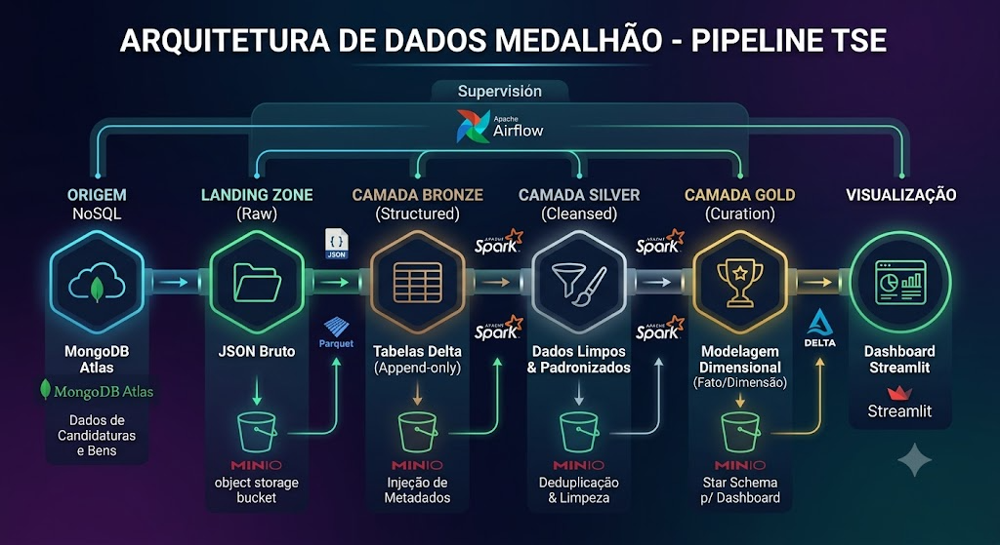

# Projeto Pipeline de Dados Eleitorais - TSE (Arquitetura Medalhão Local)

Projeto desenvolvido para a disciplina de Engenharia de Dados, focado na construção de um ecossistema de dados completo, automatizado e conteinerizado utilizando a **Arquitetura Medalhão (Lakehouse)**. O pipeline realiza a extração de dados brutos de uma base NoSQL na nuvem (**MongoDB Atlas**), processa e limpa os fluxos de forma distribuída via **Apache Spark (PySpark)** e consolida uma modelagem dimensional em um Data Lake local (**MinIO**) para alimentar um **Dashboard Analítico** interativo.

---

## Funcionalidades

* **Extração NoSQL para JSON:** Conexão nativa e segura com o MongoDB Atlas via `pymongo`, convertendo coleções transacionais brutas diretamente para formato JSON estruturado.
* **Esteira de Dados Medalhão:** Implementação física completa e distribuída das camadas **Landing, Bronze, Silver e Gold** utilizando tabelas **Delta Lake**.
* **Orquestração Inteligente (Airflow + Papermill):** Controle absoluto do pipeline feito por uma DAG no Apache Airflow, rodando e monitorando os Jupyter Notebooks de forma sequencial com injeção automática de parâmetros e logs.
* **Modelagem Dimensional Otimizada:** Construção de um modelo *Star Schema* (Fatos e Dimensões) na camada Gold, maximizando a performance das queries.
* **Entrega em One Page View:** Interface rica em Dark Mode construída em **Streamlit**, gerando relatórios de candidatos por cargo e patrimônio por partido através de leitura direta e rápida da camada Gold.
* **Documentação Viva:** Portal de documentação interna centralizado e gerado via **MkDocs**.

---

## Arquitetura do Ecossistema

O fluxo de dados foi desenhado seguindo a Arquitetura Medalhão (Medallion Architecture), garantindo isolamento, governança e alta qualidade da informação em cada etapa da jornada analítica:



## Tecnologias Utilizadas
- **Apache Spark (PySpark):** Engine principal de processamento distribuído das transformações.

- **Delta Lake:** Formato de armazenamento transacional ACID adotado a partir da Bronze.

- **Apache Airflow & Papermill:** Orquestrador de dependências e executor programático de notebooks.

- **MongoDB Atlas:** Banco de dados transacional na nuvem utilizado como origem (NoSQL).

- **MinIO:** Storage de objetos local (S3-compatible) simulando nosso Data Lake corporativo.

- **Streamlit:** Framework Python focado em aplicações de dados para construção do dashboard.

- **Docker & Docker Compose:** Isolamento, reprodutibilidade e gerenciamento de rede de toda a stack.

- **Poetry & MkDocs:** Gerenciador de ambientes virtuais e gerador do portal estático.

## Pré-requisitos

- **Docker** e **Docker Compose v2+**
- **Python 3.11** (PySpark 3.5.3 requer Python ≤ 3.12)
- **Poetry** — para rodar o MkDocs localmente
- **Conta no MongoDB Atlas** com string de conexão (origem dos dados)
- **Git**

## Como Executar o Projeto
Antes de começar, certifique-se de ter o Docker e o Docker Compose instalados na sua máquina de desenvolvimento.

### 1. Inicializando a Infraestrutura (Containers)
Crie um arquivo .env na raiz do projeto com base no .env.example inserindo suas credenciais do MongoDB Atlas e do MinIO. Em seguida, suba toda a stack executando:

```bash
docker-compose up -d --build
```

Isso inicializará de forma integrada:

- **Jupyter Lab (Spark-Lab):** Rodando em http://localhost:8888

- **MinIO Console:** Rodando em http://localhost:9021 (API na porta 9000)

- **Apache Airflow:** Rodando em http://localhost:8080

- **Dashboard Streamlit:** Rodando em http://localhost:8501

### 2. Executando a Esteira de Dados (Orquestração)

1. Acesse o painel do Airflow em http://localhost:8080 (Usuário e senha padrão configurados no seu .env).

2. Localize a DAG tse_medallion_papermill.

3. Ative a DAG (mude a chave para Unpause) e clique no botão de Trigger (Play) para rodar o pipeline completo.

4. O Airflow executará sequencialmente os notebooks do diretório notebook/, injetará os metadados e persistirá as evidências de execução no volume compartilhado papermill-output.

### 3. Visualizando o Dashboard Analítico
Assim que a DAG concluir com sucesso (ficar verde até a tarefa da Gold), os dados estruturados estarão prontos.

- Acesse http://localhost:8501 no navegador para interagir com os filtros eleitorais e gráficos consolidados do painel do TSE.

### 4. Visualizando a Documentação Local (MkDocs)
Para explorar as transformações exatas feitas campo a campo nas camadas Silver e Gold:

```bash
# Instalar dependências locais via Poetry
poetry install

# Inicializar o servidor do MkDocs
poetry run mkdocs serve
```

- Acesse http://127.0.0.1:8000 para ler o portal completo com diagramas interativos.

## Estrutura do Projeto

```
trabalho-engenharia-de-dados/
├── docker-compose.yml          # Orquestra Jupyter, MinIO, Airflow e Streamlit
├── docker/
│   └── Dockerfile              # Imagem base do ambiente Spark
├── .env.example                # Template de variáveis de ambiente
├── .python-version             # Python 3.11
├── pyproject.toml              # Dependências Python (Poetry)
├── startup/
│   └── 00_startup.py           # Script de inicialização do ambiente
├── notebook/                   # Esteira Medalhão (executada via Airflow/Papermill)
│   ├── 00_setup_buckets.ipynb  # Criação dos buckets no MinIO
│   ├── 01_landing.ipynb        # Extração MongoDB Atlas → Landing (JSON)
│   ├── 02_bronze.ipynb         # Landing → Bronze (Delta)
│   ├── 03_silver.ipynb         # Bronze → Silver (limpeza/conformação)
│   └── 04_gold.ipynb           # Silver → Gold (Star Schema)
├── dashboard/                  # Aplicação Streamlit (One Page View)
│   ├── app.py                  # Entrypoint do dashboard
│   ├── gold_reader.py          # Leitura da camada Gold
│   ├── kpis.py                 # Cálculo dos indicadores
│   └── minio_connection.py     # Conexão com o MinIO
├── docs/                       # Fontes da documentação (MkDocs)
├── mkdocs.yml                  # Configuração do portal de docs
└── README.md
```

## Conceitos Demonstrados

- **Arquitetura Medalhão** (Landing → Bronze → Silver → Gold)
- **Extração de dados NoSQL** (MongoDB Atlas) para um Data Lake
- **Object Storage** S3-compatible (MinIO) como camada de armazenamento
- **Delta Lake** como formato lakehouse com transações **ACID**
- **Modelagem Dimensional** (Star Schema) na camada Gold
- **Orquestração de pipelines** com Apache Airflow + Papermill
- **Visualização analítica** em One Page View (Streamlit)
- **Documentação como código** (MkDocs)

## Equipe

Abaixo encontra-se a estrutura de governança, ocupação e os links diretos para os perfis profissionais de cada integrante do time de Engenharia de Dados.

| Integrante | Ocupação | Links de Contato |
| :--- | :--- | :--- |
| **Alexandre Tibes da Silva** | Analista de Suporte e Implantação |  [GitHub](https://github.com/Xandetds) |
| **Bruno Monteiro Bonifacio** | Desenvolvedor JR |  [GitHub](https://github.com/brunomonteirobonifacio) \| [LinkedIn](https://www.linkedin.com/in/bruno-monteiro-bonif%C3%A1cio-257338272/) |
| **Gianluca Andrade Silvestre** | Desenvolvedor PL |  [GitHub](https://github.com/GiaNinWorld) \| [LinkedIn](https://www.linkedin.com/in/gianluca-andrade-silvestre-6205622b8/) |
| **Gustavo de Freitas Cardoso** | Produção de Persianas |  [GitHub](https://github.com/GustavodeFreitasCardoso) |
| **João Miguel Fortunato Rita** | Desenvolvedor JR |  [GitHub](https://github.com/JoaoMiguelRita) \| [LinkedIn](https://www.linkedin.com/in/jo%C3%A3o-miguel-fortunato-rita-623962219/) |
| **Luis Filipe Damiani Colombo** | Analista de Suporte |  [GitHub](https://github.com/luisfilipedm) \| [LinkedIn](https://www.linkedin.com/in/luis-filipe-damiani-colombo-b060572b6/) |
| **Murilo Salvan** | Manutenção Eletrônica |  [GitHub](https://github.com/omrl) \| [LinkedIn](https://www.linkedin.com/in/murilo-salvan-1605b9382/) |
| **Roger Balcevicz** | Desenvolvedor JR |  [GitHub](https://github.com/Roger-Balcevicz) \| [LinkedIn](https://www.linkedin.com/in/roger-balcevicz-426053381/) |

---

## Referências Técnicas

* **[Streamlit Docs](https://docs.streamlit.io/)**: Referência para componentes visuais e estados do app.
* **[Apache Spark Python API](https://spark.apache.org/docs/latest/api/python/index.html)**: Guia de funções distribuídas e manipulação de DataFrames.
* **[Delta Lake Core Guide](https://docs.delta.io/latest/index.html)**: Otimizações e gravações em formato ACID.
* **[Papermill Documentation](https://papermill.readthedocs.io/)**: Lógica de parametrização e execução de notebooks via terminal/Python.
* **[Apache Airflow Architecture](https://airflow.apache.org/docs/apache-airflow/stable/index.html)**: Melhores práticas para definição de DAGs e PythonOperators.