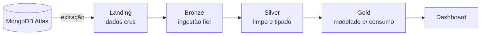

# Arquitetura Medalhão

A **arquitetura medalhão** organiza os dados em camadas sucessivas — Landing, Bronze, Silver e Gold — em que cada etapa eleva a qualidade, a estrutura e o valor da informação. A ideia é separar claramente o dado cru do dado tratado e do dado pronto para consumo, tornando o pipeline rastreável e reprocessável: se algo der errado em uma camada, as anteriores permanecem intactas como fonte da verdade.

No projeto, cada camada (a partir da Bronze) é uma ou mais tabelas Delta Lake persistidas no MinIO, e a transição entre elas é feita pelo Spark.

A qualidade e a estruturação crescem da esquerda para a direita; o volume e a granularidade tendem a diminuir conforme os dados são agregados.

## Landing

Primeira parada dos dados extraídos da origem. Aqui os arquivos são gravados **exatamente como chegam** do MongoDB Atlas, sem nenhuma transformação. Serve como uma cópia bruta e imutável da extração, que permite reprocessar as camadas seguintes sem precisar consultar a origem novamente.

## Bronze

Ingestão dos dados da Landing para o formato **Delta Lake**, ainda de forma fiel ao original — sem limpeza ou regras de negócio. As escritas são tipicamente em modo *append*, preservando o histórico de tudo que foi ingerido. É a primeira camada a se beneficiar das garantias do Delta (ACID, time travel, schema).

## Silver

Camada de **limpeza e padronização**. Aqui acontecem a deduplicação, a tipagem correta das colunas, o tratamento de valores nulos/inconsistentes e a aplicação das regras de qualidade. O resultado é um conjunto de dados confiável e consistente, mas ainda em granularidade detalhada — pronto para ser modelado.

## Gold

Camada de **consumo**. Os dados da Silver são agregados e modelados de acordo com as perguntas de negócio, materializando os KPIs e métricas que alimentam o [dashboard](../dashboard/index.md). É a camada mais próxima do usuário final e a de menor granularidade.

## Resumo das camadas

| Camada  | Conteúdo                          | Formato        | Transformação principal              |
|---------|-----------------------------------|----------------|--------------------------------------|
| Landing | Dados crus da origem              | Arquivos brutos| Nenhuma (cópia fiel)                 |
| Bronze  | Ingestão fiel em tabela           | Delta Lake     | Conversão para Delta (append)        |
| Silver  | Dados limpos e padronizados       | Delta Lake     | Limpeza, deduplicação, tipagem       |
| Gold    | Dados agregados para consumo       | Delta Lake     | Agregação e modelagem dos KPIs       |

!!! note "Conceito × execução"
    Esta página descreve o **conceito** de cada camada. O passo a passo de cada transição (Origem → Landing, Landing → Bronze, e assim por diante) está detalhado na seção [Pipeline](../pipeline/index.md).
