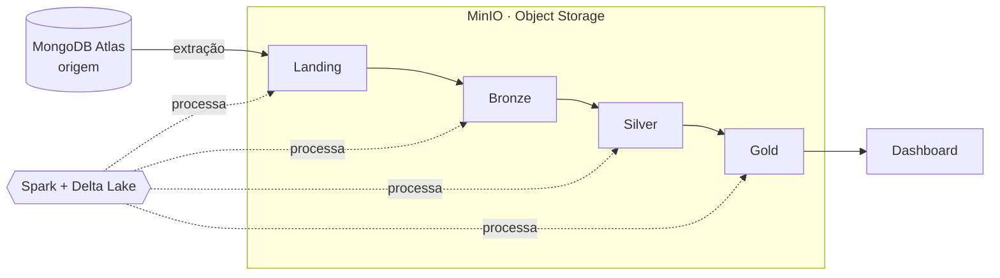

# Visão Geral

O projeto implementa um pipeline de dados em arquitetura Lakehouse: o processamento distribuído do Apache Spark combinado ao formato transacional do Delta Lake, tendo o MinIO como camada de armazenamento compatível com S3. Os dados partem da origem (MongoDB Atlas), passam pelas camadas da arquitetura medalhão e terminam disponíveis para o dashboard.

## Fluxo de ponta a ponta

O Spark + Delta Lake é o motor que executa todas as transições entre camadas; o MinIO é onde a Landing e as tabelas Delta de cada camada ficam persistidas. O detalhamento de cada transição está na seção [Pipeline](../pipeline/index.md), e o conceito das camadas em [Medalhão](medallion.md).

## 1. Spark + Delta Lake

O Apache Spark (via PySpark) é o motor de processamento distribuído do projeto. No ambiente ele roda em modo `local[*]`, aproveitando todos os núcleos da máquina, e é a única ferramenta que lê, transforma e grava os dados em todas as camadas.

O Delta Lake atua como a camada de formato de tabela por cima do Parquet, adicionando ao data lake garantias que normalmente só existiriam em um banco de dados:

- Transações ACID — escritas são atômicas e consistentes, sem arquivos parciais ou corrompidos em caso de falha.
- Schema enforcement e evolution — o schema é validado na escrita e pode evoluir de forma controlada, evitando que dados fora do formato esperado entrem nas tabelas.
- Time travel — cada escrita gera uma nova versão da tabela, permitindo consultar ou reprocessar o estado dos dados em um ponto anterior.
- Upserts e deletes (via `MERGE`) — essenciais para deduplicação e atualização incremental nas camadas Silver e Gold.

As versões de Spark e Delta são fixadas no `pyproject.toml` (`pyspark 3.5.3` e `delta-spark 3.2.0`) e precisam permanecer em sincronia, pois cada versão do Delta é compatível com uma faixa específica de Spark. A `SparkSession` já vem configurada com a extensão do Delta (`DeltaSparkSessionExtension` + `DeltaCatalog`) em todo notebook, de modo que é possível ler e gravar tabelas Delta diretamente em `s3a://...`.

## 2. Object Storage

O sistema utiliza MinIO como object storage, para armazenar os arquivos vindos do sistema de origem, e as tabelas do Delta Lake provenientes das demais camadas da arquitetura medalhão.

O MinIO é um servidor de armazenamento de objetos compatível com a API S3 da AWS. É ele que dá ao projeto a característica de Lakehouse: em vez de um sistema de arquivos local ou de um data warehouse fechado, os dados ficam em buckets de objetos (baratos, escaláveis e desacoplados do processamento), e o Spark lê e grava diretamente sobre eles.

A ponte entre o Spark e o MinIO é o conector S3A do Hadoop (`spark.hadoop.fs.s3a.*`): o Spark é apontado para o endpoint do MinIO dentro da rede do Docker (ex.: `http://minio:9000`), com `path.style.access` habilitado e SSL desligado por ser um ambiente local. Com isso, um caminho `s3a://bucket/camada/...` é tratado pelo Spark como se fosse o S3 da AWS, e cada camada do medalhão grava sua tabela Delta no bucket correspondente.

Para operações fora do Spark — criar buckets, listar ou inspecionar objetos — também há um cliente boto3 (`minio`) disponível nos notebooks, apontando para o mesmo endpoint. O console web do MinIO fica em `http://localhost:9021` e a API S3 publicada no host em `http://localhost:9020`.

## 3. Ambiente containerizado (Docker)

Todo o ambiente é provisionado com Docker, o que garante reprodutibilidade: qualquer integrante sobe a mesma stack com um único comando, sem instalar Spark, Java ou dependências na máquina. O `docker-compose.yml` orquestra dois serviços:

- `spark-lab` — a imagem do Jupyter Lab + PySpark, construída a partir de `docker/Dockerfile`. Ela já traz o JRE necessário para o Spark e as dependências do projeto (instaladas via Poetry no build), além dos scripts de bootstrap que preparam a `SparkSession` e as conexões a cada início de kernel.
- `minio` — o servidor de object storage, com os dados persistidos em um volume nomeado para sobreviver entre execuções dos containers.

Os dois serviços compartilham a mesma rede do Compose, o que permite o Spark acessar o MinIO pelo nome do serviço (ex.: `http://minio:9000`) em vez da porta publicada no host.

O passo a passo para subir o ambiente (comandos, variáveis de ambiente e portas) está na seção [Setup](../setup/index.md).
