# Especificação Técnica do Ecossistema do Dashboard

```mermaid
graph LR
    A[MongoDB Atlas <br> Nuvem] -->|Autenticação e Leitura| B(Jupyter Lab / Spark-Lab)
    B -->|Processamento & Transformação| C[MinIO Storage <br> Camada Gold]
    C -->|Leitura de Parquet/CSV| D(Streamlit Dashboard)
    D -->|Exibição Visual| E[Navegador do Usuário]

    style A fill:#4DB33D,stroke:#333,stroke-width:2px,color:#fff
    style B fill:#F37626,stroke:#333,stroke-width:2px,color:#fff
    style C fill:#C72C48,stroke:#333,stroke-width:2px,color:#fff
    style D fill:#FF4B4B,stroke:#333,stroke-width:2px,color:#fff
    style E fill:#1E88E5,stroke:#333,stroke-width:2px,color:#fff
```

Este documento detalha o funcionamento técnico, a arquitetura de contêineres, as ferramentas de engenharia empregadas (incluindo o pipeline de notebooks) e os procedimentos operacionais para compilar e executar o painel em ambiente local.

---

## 1. Estrutura de Desenvolvimento e Arquitetura do Projeto

Uma das principais características deste projeto foi a adoção de um modelo de desenvolvimento descentralizado e isolado. Cada componente da solução foi construído através de uma **branch dedicada de funcionalidades (feature branch)**, garantindo que as frentes de trabalho avançassem em paralelo sem gerar conflitos prematuros no repositório principal (`master`).

### A Dinâmica das Branches:
* **Branch do Dashboard (Feature 48):** Onde toda a lógica visual, componentes do Streamlit e algoritmos de agregação de gráficos foram construídos na One Page View final.
* **Branch de Documentação (Feature 58):** Onde o ecossistema Docker foi unificado, as redes e permissões foram calibradas, e este guia técnico foi estruturado.

Essa abordagem de desenvolvimento distribuído exige que o ambiente local seja inicializado seguindo uma ordem restrita de dependências técnicas para que os dados fluam corretamente.

---

## 2. O Pipeline de Processamento (Jupyter Notebooks)

Antes de o dashboard exibir qualquer informação na tela, os dados brutos passam por um processo rigoroso de tratamento estruturado dentro do ambiente do **Jupyter Lab (Spark-Lab)**. Os notebooks do projeto atuam como os motores de transformação da nossa arquitetura de dados.

### Papel dos Notebooks no Fluxo:
1. **Consumo da Camada Raw/Ingestão:** Os notebooks conectam-se às fontes brutas e extraem dados de transações e metadados direto para o ecossistema.
2. **Conexão com o MongoDB Atlas:** Através da biblioteca `pymongo`, os notebooks autenticam-se de forma segura na nuvem usando uma URI parametrizada para ler e validar coleções estruturadas.
3. **Escrita na Camada Gold (MinIO):** Utilizando o poder do PySpark ou Pandas, as transformações finais de negócio ocorrem e as tabelas resultantes são salvas como arquivos de performance (como Parquet ou CSV) dentro da árvore de diretórios local do MinIO no caminho específico: `gold/tse/fato_candidatura_dashboard/`.

---

## 3. Tecnologias Utilizadas na Stack Técnica

* **Linguagem Base:** Python 3.11
* **Interface Visual:** Streamlit
* **Ambiente de Processamento:** Jupyter Lab com PySpark e PyMongo
* **Gerenciador de Dependências:** Poetry / Pip
* **Conteinerização:** Docker e Docker Compose
* **Armazenamento Local:** MinIO Object Storage
* **Armazenamento em Nuvem:** MongoDB Atlas Cloud

---

## 4. Requisitos de Ambiente (Variáveis do `.env`)

O arquivo `.env` deve ser mantido estritamente na raiz do projeto (um nível acima da pasta `dashboard`). As credenciais não devem conter delimitadores como `<` ou `>` para evitar quebras de autenticação nos interpretadores:

```env
# ==========================================
# INSTRUÇÕES PARA NOVOS DESENVOLVEDORES:
# 1. Faça uma cópia deste arquivo e renomeie para ".env"
# 2. Configure seu usuário no mongo atlas
# 3. Substitua as tags <seu_usuario> e <sua_senha> pelas suas credenciais reais
# ==========================================

MONGO_URI=mongodb+srv://<seu_usuario>:<sua_senha>@trabalho-final-engenhar.fj4mcny.mongodb.net/?appName=trabalho-final-engenharia-dados
MONGO_DB_NAME=trabalho-final-engenharia-dados

MINIO_ENDPOINT=http://minio:9000
MINIO_ACCESS_KEY=<minio-access-key>
MINIO_SECRET_KEY=<minio-secret-key>

# URL do MinIO para uso no Dashboard quando rodado localmente (quando rodado via Docker a URL é definida no docker-compose.yml)
MINIO_DASHBOARD_ENDPOINT=http://localhost:9020
```
## 5. Manual de Execução Local (Passo a Passo)
Siga este procedimento lógico em seu terminal PowerShell para construir a infraestrutura do zero, gerar a massa de dados e visualizar o painel analítico.

#### Passo 1: Inicializando os Serviços Principais e Jupyter
A partir do diretório raiz do projeto (trabalho-engenharia-de-dados), suba os serviços base de infraestrutura e processamento:

```
# Garantir que instâncias antigas sejam removidas e redefinir o build
docker-compose down
docker-compose up -d --build
```
#### Passo 2: Executando os Notebooks no Jupyter
Abra o navegador web no endereço: ```http://localhost:8888```

Acesse a pasta onde os notebooks desenvolvidos estão organizados.

Execute as células de todos os notebooks na ordem cronológica de desenvolvimento para disparar a autenticação com o MongoDB Atlas, processar os dados eleitorais e estruturar o bucket gold automaticamente dentro do MinIO.

## 6. Monitoramento Operacional
Uma vez que o pipeline de notebooks concluiu a carga dos dados e o container do dashboard já foi inicializado pelo Compose, a interface gráfica estará disponível de forma contínua em seu navegador através do link:
```http://localhost:8501```