# Visão Geral do Pipeline de Dados

Bem-vindo à documentação do *Pipeline de Engenharia de Dados*. Esta seção detalha a esteira de processamento responsável por extrair os dados eleitorais brutos, tratá-los e disponibilizá-los para análise final.

Nosso fluxo de dados foi construído seguindo os princípios da *Arquitetura Medalhão (Medallion Architecture)*, que divide o Data Lake em camadas lógicas progressivas de qualidade e agregação (Landing, Bronze, Silver e Gold).

---

## Arquitetura e Fluxo de Dados

O diagrama abaixo ilustra o caminho que a informação percorre desde a origem no banco de dados NoSQL até a entrega estruturada para o Dashboard:

```mermaid
graph LR
    %% Fontes e Destinos
    Origem[(MongoDB Atlas <br> Origem NoSQL)]
    Landing[Landing Zone <br> JSON Bruto]
    Bronze[Camada Bronze <br> Delta Lake]
    Silver[Camada Silver <br> Delta Lake]
    Gold[Camada Gold <br> Star Schema]
    Dash[Dashboard <br> Streamlit]

    %% Conexões e Processamento
    Origem -->|01_landing.ipynb| Landing
    Landing -->|02_bronze.ipynb <br> Tipagem e Metadados| Bronze
    Bronze -->|03_silver.ipynb <br> Limpeza e Padronização| Silver
    Silver -->|04_gold.ipynb <br> Agregação e Relacionamento| Gold
    Gold -.->|Leitura Direta| Dash

    %% Estilos para Dark Mode
    style Origem fill:#1B5E20,stroke:#4CAF50,stroke-width:2px,color:#FFF
    style Landing fill:#303030,stroke:#9E9E9E,stroke-width:2px,color:#FFF
    style Bronze fill:#4E342E,stroke:#A1887F,stroke-width:2px,color:#FFF
    style Silver fill:#37474F,stroke:#90A4AE,stroke-width:2px,color:#FFF
    style Gold fill:#F9A825,stroke:#FFF176,stroke-width:2px,color:#111
    style Dash fill:#B71C1C,stroke:#E57373,stroke-width:2px,color:#FFF
```

## Stack Tecnológica de Processamento
A esteira de dados foi desenvolvida em Jupyter Notebooks (Spark-Lab), utilizando as seguintes tecnologias principais:

- *PySpark:* Motor de processamento distribuído utilizado nas camadas Bronze, Silver e Gold para leitura, transformação de schemas, limpeza de strings e escrita otimizada em larga escala.

- *PyMongo:* Biblioteca utilizada para a extração nativa das coleções hospedadas na nuvem do MongoDB Atlas.

- *Delta Lake:* Formato de armazenamento de código aberto adotado a partir da camada Bronze, garantindo confiabilidade (transações ACID) e alta performance nas consultas.

- *MinIO (boto3 / S3-compatible):* Storage local de objetos utilizado para acomodar fisicamente os buckets de todas as camadas do Data Lake.

## Estrutura da Esteira
O processamento ocorre de forma sequencial. Explore o menu lateral para entender as regras técnicas e lógicas aplicadas em cada etapa:

- [Setup da Infra:](setup.md) Configuração inicial dos buckets no storage.

- [Camada Landing:](landing.md) Ingestão dos dados originais em formato JSON.

- [Camada Bronze:](bronze.md) Tipagem colunar, armazenamento Delta e injeção de metadados.

- [Camada Silver:](silver.md) Limpeza profunda, padronização e remoção de duplicatas.

- [Camada Gold:](gold.md) Modelagem dimensional (Fato/Dimensão) para o painel analítico.