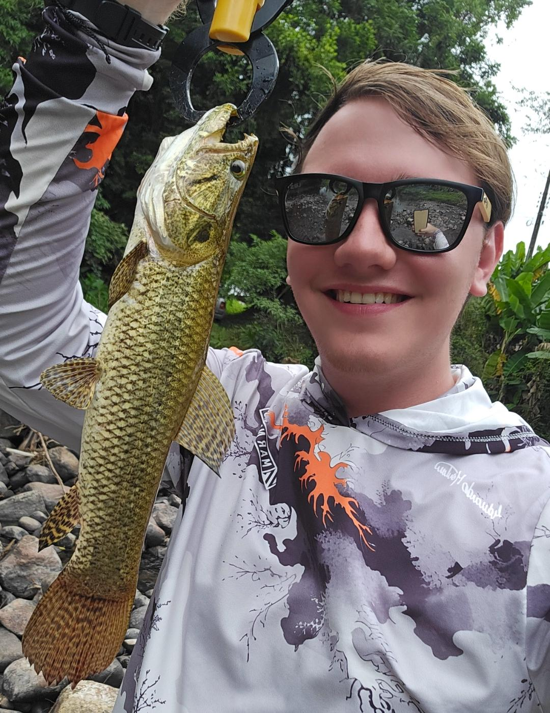

# Equipe

Estrutura de governança e atribuições técnicas do time de Engenharia de Dados. Abaixo, encontra-se o mapa geral e, no menu lateral, o detalhamento das entregas e responsabilidades ativas de cada integrante.

  

    
    <h3>Alexandre Tibes da Silva</h3>
    
Analista de Suporte e Implantação

    

      <a href="https://github.com/Xandetds" target="_blank" title="GitHub"><svg viewBox="0 0 24 24"><path d="M12 2A10 10 0 0 0 2 12c0 4.42 2.87 8.17 6.84 9.5.5.08.66-.23.66-.5v-1.69c-2.77.6-3.36-1.34-3.36-1.34-.46-1.16-1.11-1.47-1.11-1.47-.91-.62.07-.6.07-.6 1 .07 1.53 1.03 1.53 1.03.87 1.52 2.34 1.07 2.91.83.09-.65.35-1.09.63-1.34-2.22-.25-4.55-1.11-4.55-4.92 0-1.11.38-2 1.03-2.71-.1-.25-.45-1.29.1-2.64 0 0 .84-.27 2.75 1.02.79-.22 1.65-.33 2.5-.33.85 0 1.71.11 2.5.33 1.91-1.29 2.75-1.02 2.75-1.02.55 1.35.2 2.39.1 2.64.65.71 1.03 1.6 1.03 2.71 0 3.82-2.34 4.66-4.57 4.91.36.31.69.92.69 1.85V21c0 .27.16.59.67.5C19.14 20.16 22 16.42 22 12A10 10 0 0 0 12 2z"/></svg></a>
      </a>
    

  

  

    
    <h3>Bruno Monteiro Bonifacio</h3>
    
Desenvolvedor JR

    

      <a href="https://github.com/brunomonteirobonifacio" target="_blank" title="GitHub"><svg viewBox="0 0 24 24"><path d="M12 2A10 10 0 0 0 2 12c0 4.42 2.87 8.17 6.84 9.5.5.08.66-.23.66-.5v-1.69c-2.77.6-3.36-1.34-3.36-1.34-.46-1.16-1.11-1.47-1.11-1.47-.91-.62.07-.6.07-.6 1 .07 1.53 1.03 1.53 1.03.87 1.52 2.34 1.07 2.91.83.09-.65.35-1.09.63-1.34-2.22-.25-4.55-1.11-4.55-4.92 0-1.11.38-2 1.03-2.71-.1-.25-.45-1.29.1-2.64 0 0 .84-.27 2.75 1.02.79-.22 1.65-.33 2.5-.33.85 0 1.71.11 2.5.33 1.91-1.29 2.75-1.02 2.75-1.02.55 1.35.2 2.39.1 2.64.65.71 1.03 1.6 1.03 2.71 0 3.82-2.34 4.66-4.57 4.91.36.31.69.92.69 1.85V21c0 .27.16.59.67.5C19.14 20.16 22 16.42 22 12A10 10 0 0 0 12 2z"/></svg></a>
      <a href="https://www.linkedin.com/in/bruno-monteiro-bonif%C3%A1cio-257338272/" target="_blank" title="LinkedIn"><svg viewBox="0 0 24 24"><path d="M19 3a2 2 0 0 1 2 2v14a2 2 0 0 1-2 2H5a2 2 0 0 1-2-2V5a2 2 0 0 1 2-2h14m-.5 15.5v-5.3a3.26 3.26 0 0 0-3.26-3.26c-.85 0-1.84.52-2.32 1.3v-1.11h-2.79v8.37h2.79v-4.93c0-.77.62-1.4 1.39-1.4a1.4 1.4 0 0 1 1.4 1.4v4.93h2.79M6.88 8.56a1.68 1.68 0 0 0 1.68-1.68c0-.93-.75-1.69-1.68-1.69a1.69 1.69 0 0 0-1.69 1.69c0 .93.76 1.68 1.69 1.68m1.39 9.94v-8.37H5.5v8.37h2.77z"/></svg></a>
    

  

  

    
    <h3>Gianluca Andrade Silvestre</h3>
    
Desenvolvedor PL

    

      <a href="https://github.com/GiaNinWorld" target="_blank" title="GitHub"><svg viewBox="0 0 24 24"><path d="M12 2A10 10 0 0 0 2 12c0 4.42 2.87 8.17 6.84 9.5.5.08.66-.23.66-.5v-1.69c-2.77.6-3.36-1.34-3.36-1.34-.46-1.16-1.11-1.47-1.11-1.47-.91-.62.07-.6.07-.6 1 .07 1.53 1.03 1.53 1.03.87 1.52 2.34 1.07 2.91.83.09-.65.35-1.09.63-1.34-2.22-.25-4.55-1.11-4.55-4.92 0-1.11.38-2 1.03-2.71-.1-.25-.45-1.29.1-2.64 0 0 .84-.27 2.75 1.02.79-.22 1.65-.33 2.5-.33.85 0 1.71.11 2.5.33 1.91-1.29 2.75-1.02 2.75-1.02.55 1.35.2 2.39.1 2.64.65.71 1.03 1.6 1.03 2.71 0 3.82-2.34 4.66-4.57 4.91.36.31.69.92.69 1.85V21c0 .27.16.59.67.5C19.14 20.16 22 16.42 22 12A10 10 0 0 0 12 2z"/></svg></a>
      <a href="https://www.linkedin.com/in/gianluca-andrade-silvestre-6205622b8/" target="_blank" title="LinkedIn"><svg viewBox="0 0 24 24"><path d="M19 3a2 2 0 0 1 2 2v14a2 2 0 0 1-2 2H5a2 2 0 0 1-2-2V5a2 2 0 0 1 2-2h14m-.5 15.5v-5.3a3.26 3.26 0 0 0-3.26-3.26c-.85 0-1.84.52-2.32 1.3v-1.11h-2.79v8.37h2.79v-4.93c0-.77.62-1.4 1.39-1.4a1.4 1.4 0 0 1 1.4 1.4v4.93h2.79M6.88 8.56a1.68 1.68 0 0 0 1.68-1.68c0-.93-.75-1.69-1.68-1.69a1.69 1.69 0 0 0-1.69 1.69c0 .93.76 1.68 1.69 1.68m1.39 9.94v-8.37H5.5v8.37h2.77z"/></svg></a>
    

  

  

    
    <h3>Gustavo de Freitas Cardoso</h3>
    
Produção de Persianas

    

      <a href="https://github.com/GustavodeFreitasCardoso" target="_blank" title="GitHub"><svg viewBox="0 0 24 24"><path d="M12 2A10 10 0 0 0 2 12c0 4.42 2.87 8.17 6.84 9.5.5.08.66-.23.66-.5v-1.69c-2.77.6-3.36-1.34-3.36-1.34-.46-1.16-1.11-1.47-1.11-1.47-.91-.62.07-.6.07-.6 1 .07 1.53 1.03 1.53 1.03.87 1.52 2.34 1.07 2.91.83.09-.65.35-1.09.63-1.34-2.22-.25-4.55-1.11-4.55-4.92 0-1.11.38-2 1.03-2.71-.1-.25-.45-1.29.1-2.64 0 0 .84-.27 2.75 1.02.79-.22 1.65-.33 2.5-.33.85 0 1.71.11 2.5.33 1.91-1.29 2.75-1.02 2.75-1.02.55 1.35.2 2.39.1 2.64.65.71 1.03 1.6 1.03 2.71 0 3.82-2.34 4.66-4.57 4.91.36.31.69.92.69 1.85V21c0 .27.16.59.67.5C19.14 20.16 22 16.42 22 12A10 10 0 0 0 12 2z"/></svg></a>
      </a>
    

  

  

    
    <h3>João Miguel Fortunato Rita</h3>
    
Desenvolvedor JR

    

      <a href="https://github.com/JoaoMiguelRita" target="_blank" title="GitHub"><svg viewBox="0 0 24 24"><path d="M12 2A10 10 0 0 0 2 12c0 4.42 2.87 8.17 6.84 9.5.5.08.66-.23.66-.5v-1.69c-2.77.6-3.36-1.34-3.36-1.34-.46-1.16-1.11-1.47-1.11-1.47-.91-.62.07-.6.07-.6 1 .07 1.53 1.03 1.53 1.03.87 1.52 2.34 1.07 2.91.83.09-.65.35-1.09.63-1.34-2.22-.25-4.55-1.11-4.55-4.92 0-1.11.38-2 1.03-2.71-.1-.25-.45-1.29.1-2.64 0 0 .84-.27 2.75 1.02.79-.22 1.65-.33 2.5-.33.85 0 1.71.11 2.5.33 1.91-1.29 2.75-1.02 2.75-1.02.55 1.35.2 2.39.1 2.64.65.71 1.03 1.6 1.03 2.71 0 3.82-2.34 4.66-4.57 4.91.36.31.69.92.69 1.85V21c0 .27.16.59.67.5C19.14 20.16 22 16.42 22 12A10 10 0 0 0 12 2z"/></svg></a>
      <a href="https://www.linkedin.com/in/jo%C3%A3o-miguel-fortunato-rita-623962219/" target="_blank" title="LinkedIn"><svg viewBox="0 0 24 24"><path d="M19 3a2 2 0 0 1 2 2v14a2 2 0 0 1-2 2H5a2 2 0 0 1-2-2V5a2 2 0 0 1 2-2h14m-.5 15.5v-5.3a3.26 3.26 0 0 0-3.26-3.26c-.85 0-1.84.52-2.32 1.3v-1.11h-2.79v8.37h2.79v-4.93c0-.77.62-1.4 1.39-1.4a1.4 1.4 0 0 1 1.4 1.4v4.93h2.79M6.88 8.56a1.68 1.68 0 0 0 1.68-1.68c0-.93-.75-1.69-1.68-1.69a1.69 1.69 0 0 0-1.69 1.69c0 .93.76 1.68 1.69 1.68m1.39 9.94v-8.37H5.5v8.37h2.77z"/></svg></a>
    

  

  

    
    <h3>Luis Filipe Damiani Colombo</h3>
    
Analista de Suporte

    

      <a href="https://github.com/luisfilipedm" target="_blank" title="GitHub"><svg viewBox="0 0 24 24"><path d="M12 2A10 10 0 0 0 2 12c0 4.42 2.87 8.17 6.84 9.5.5.08.66-.23.66-.5v-1.69c-2.77.6-3.36-1.34-3.36-1.34-.46-1.16-1.11-1.47-1.11-1.47-.91-.62.07-.6.07-.6 1 .07 1.53 1.03 1.53 1.03.87 1.52 2.34 1.07 2.91.83.09-.65.35-1.09.63-1.34-2.22-.25-4.55-1.11-4.55-4.92 0-1.11.38-2 1.03-2.71-.1-.25-.45-1.29.1-2.64 0 0 .84-.27 2.75 1.02.79-.22 1.65-.33 2.5-.33.85 0 1.71.11 2.5.33 1.91-1.29 2.75-1.02 2.75-1.02.55 1.35.2 2.39.1 2.64.65.71 1.03 1.6 1.03 2.71 0 3.82-2.34 4.66-4.57 4.91.36.31.69.92.69 1.85V21c0 .27.16.59.67.5C19.14 20.16 22 16.42 22 12A10 10 0 0 0 12 2z"/></svg></a>
      <a href="https://www.linkedin.com/in/luis-filipe-damiani-colombo-b060572b6/" target="_blank" title="LinkedIn"><svg viewBox="0 0 24 24"><path d="M19 3a2 2 0 0 1 2 2v14a2 2 0 0 1-2 2H5a2 2 0 0 1-2-2V5a2 2 0 0 1 2-2h14m-.5 15.5v-5.3a3.26 3.26 0 0 0-3.26-3.26c-.85 0-1.84.52-2.32 1.3v-1.11h-2.79v8.37h2.79v-4.93c0-.77.62-1.4 1.39-1.4a1.4 1.4 0 0 1 1.4 1.4v4.93h2.79M6.88 8.56a1.68 1.68 0 0 0 1.68-1.68c0-.93-.75-1.69-1.68-1.69a1.69 1.69 0 0 0-1.69 1.69c0 .93.76 1.68 1.69 1.68m1.39 9.94v-8.37H5.5v8.37h2.77z"/></svg></a>
    

  

  

    
    <h3>Murilo Salvan</h3>
    
Manutenção Eletrônica

    

      <a href="https://github.com/omrl" target="_blank" title="GitHub"><svg viewBox="0 0 24 24"><path d="M12 2A10 10 0 0 0 2 12c0 4.42 2.87 8.17 6.84 9.5.5.08.66-.23.66-.5v-1.69c-2.77.6-3.36-1.34-3.36-1.34-.46-1.16-1.11-1.47-1.11-1.47-.91-.62.07-.6.07-.6 1 .07 1.53 1.03 1.53 1.03.87 1.52 2.34 1.07 2.91.83.09-.65.35-1.09.63-1.34-2.22-.25-4.55-1.11-4.55-4.92 0-1.11.38-2 1.03-2.71-.1-.25-.45-1.29.1-2.64 0 0 .84-.27 2.75 1.02.79-.22 1.65-.33 2.5-.33.85 0 1.71.11 2.5.33 1.91-1.29 2.75-1.02 2.75-1.02.55 1.35.2 2.39.1 2.64.65.71 1.03 1.6 1.03 2.71 0 3.82-2.34 4.66-4.57 4.91.36.31.69.92.69 1.85V21c0 .27.16.59.67.5C19.14 20.16 22 16.42 22 12A10 10 0 0 0 12 2z"/></svg></a>
      <a href="https://www.linkedin.com/in/murilo-salvan-1605b9382/" target="_blank" title="LinkedIn"><svg viewBox="0 0 24 24"><path d="M19 3a2 2 0 0 1 2 2v14a2 2 0 0 1-2 2H5a2 2 0 0 1-2-2V5a2 2 0 0 1 2-2h14m-.5 15.5v-5.3a3.26 3.26 0 0 0-3.26-3.26c-.85 0-1.84.52-2.32 1.3v-1.11h-2.79v8.37h2.79v-4.93c0-.77.62-1.4 1.39-1.4a1.4 1.4 0 0 1 1.4 1.4v4.93h2.79M6.88 8.56a1.68 1.68 0 0 0 1.68-1.68c0-.93-.75-1.69-1.68-1.69a1.69 1.69 0 0 0-1.69 1.69c0 .93.76 1.68 1.69 1.68m1.39 9.94v-8.37H5.5v8.37h2.77z"/></svg></a>
    

  

  

    
    <h3>Roger Balcevicz</h3>
    
Desenvolvedor JR

    

      <a href="https://github.com/Roger-Balcevicz" target="_blank" title="GitHub"><svg viewBox="0 0 24 24"><path d="M12 2A10 10 0 0 0 2 12c0 4.42 2.87 8.17 6.84 9.5.5.08.66-.23.66-.5v-1.69c-2.77.6-3.36-1.34-3.36-1.34-.46-1.16-1.11-1.47-1.11-1.47-.91-.62.07-.6.07-.6 1 .07 1.53 1.03 1.53 1.03.87 1.52 2.34 1.07 2.91.83.09-.65.35-1.09.63-1.34-2.22-.25-4.55-1.11-4.55-4.92 0-1.11.38-2 1.03-2.71-.1-.25-.45-1.29.1-2.64 0 0 .84-.27 2.75 1.02.79-.22 1.65-.33 2.5-.33.85 0 1.71.11 2.5.33 1.91-1.29 2.75-1.02 2.75-1.02.55 1.35.2 2.39.1 2.64.65.71 1.03 1.6 1.03 2.71 0 3.82-2.34 4.66-4.57 4.91.36.31.69.92.69 1.85V21c0 .27.16.59.67.5C19.14 20.16 22 16.42 22 12A10 10 0 0 0 12 2z"/></svg></a>
      <a href="https://www.linkedin.com/in/roger-balcevicz-426053381/" target="_blank" title="LinkedIn"><svg viewBox="0 0 24 24"><path d="M19 3a2 2 0 0 1 2 2v14a2 2 0 0 1-2 2H5a2 2 0 0 1-2-2V5a2 2 0 0 1 2-2h14m-.5 15.5v-5.3a3.26 3.26 0 0 0-3.26-3.26c-.85 0-1.84.52-2.32 1.3v-1.11h-2.79v8.37h2.79v-4.93c0-.77.62-1.4 1.39-1.4a1.4 1.4 0 0 1 1.4 1.4v4.93h2.79M6.88 8.56a1.68 1.68 0 0 0 1.68-1.68c0-.93-.75-1.69-1.68-1.69a1.69 1.69 0 0 0-1.69 1.69c0 .93.76 1.68 1.69 1.68m1.39 9.94v-8.37H5.5v8.37h2.77z"/></svg></a>
    

  

---

## 🟣 Coordenação e Infraestrutura Base

Camada responsável pelo ecossistema central, controle de qualidade das branches e governança do Data Lake.

  <h3>Alexandre Tibes da Silva</h3>
  
Fundador e mantenedor principal do repositório, atua na liderança técnica e governança do projeto. Responsável por avaliar e aprovar Pull Requests, além de gerenciar os merges de branches estratégicas. No pipeline, desenvolveu a ingestão da base de origem para a camada Landing.

  <h3>Bruno Monteiro Bonifacio</h3>
  
Arquiteto encarregado pelo provisionamento estrutural da plataforma. Desenhou e configurou a infraestrutura do Object Storage (MinIO) e orquestrou o ambiente integrado do Jupyter Notebook acoplado ao PySpark. Responsável também por redigir e manter os guias oficiais de documentação técnica para configuração de acessos e storage do time.

##  🟣 Engenharia de Pipelines (DataOps)

Núcleo encarregado da sustentação de Jobs automatizados, agendamentos, orquestração e cargas incrementais complexas.

  <h3>Gianluca Andrade Silvestre</h3>
  
Responsável pelo ecossistema de DataOps e orquestração. Provisionou o Apache Airflow para automação e sequenciamento das tarefas (Jobs) do projeto, assegurando o controle de fluxo, dependências e monitoramento de logs de execução do pipeline.

  <h3>Gustavo de Freitas Cardoso</h3>
  
Especialista responsável por grande parte do desenvolvimento e arquitetura da camada Gold do projeto. Atuou fortemente no ciclo de vida e carga dos dados, implementando a estratégia de versionamento histórico via SCD Tipo 2 para as tabelas dimensões e estruturando o controle incremental com Checkpoints para a tabela fato, além de refinar o script de extração na base de origem

## 🟣 Camadas de Dados e Analytics

Frente voltada para o ciclo inicial de ingestão da massa bruta, refatoração de regras de negócios avançadas (Gold) e visualização executiva final.

  <h3>João Miguel Fortunato Rita</h3>
  
Focado no mapeamento inicial do Dataset. Construiu a primeira modelagem física e a importação segura da massa de dados brutos TSE para o projeto. Atua no desenvolvimento de scripts Spark dedicados à transformação sistemática de dados entre as camadas Land e Bronze.

  <h3>Luis Filipe Damiani Colombo</h3>
  
Responsável pelo mapeamento inicial do projeto através da localização e validação do dataset bruto (Data Sourcing). No decorrer do desenvolvimento, assumiu a liderança de grande parte da documentação técnica do ecossistema, sendo o encarregado direto pela reestruturação do README principal e pela refatoração visual e arquitetura de páginas na Wiki do MkDocs.

  <h3>Murilo Salvan</h3>
  
Especialista em Business Intelligence e Analytics. Responsável pela concepção, modelagem conceitual e desenvolvimento do Dashboard analítico do projeto, liderando o fechamento de métricas visuais e preparativos para a apresentação executiva dos dados.

  <h3>Roger Balcevicz</h3>
  
Responsável pela idealização estrutural inicial da Wiki técnica em MkDocs do projeto. Atua de maneira transversal no suporte de documentação de processos e layouts visuais do repositório de engenharia.

